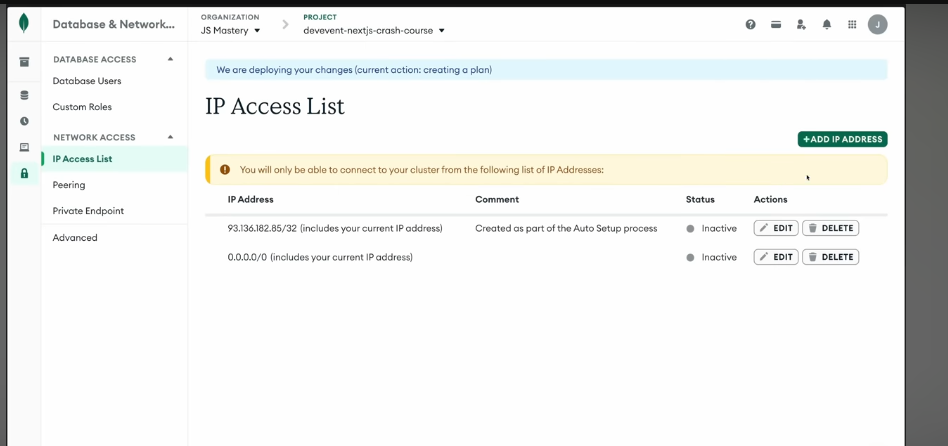
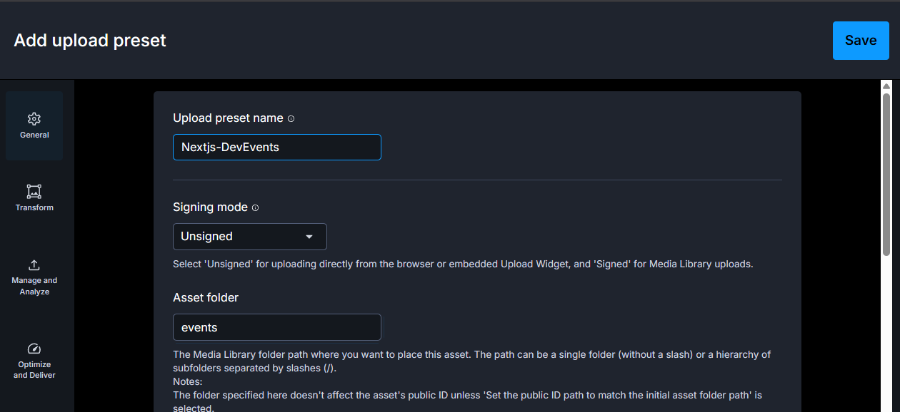

## ✅ Let's Start Project 

### Pre Setup

1. Update app/globals.css
2. npm install --save-dev tw-animate-css
3. Get public folder from Assests.zip and copy favicon icon too in app.
4. we change fonts in layout.tsx

### starting ui 
1. light ray effect using shadcn  : https://youtu.be/I1V9YWqRIeI?t=4338
npx shadcn@latest add @react-bits/LightRays-JS-CSS
2. Navbar,EventCard,Constant added.
3. pushed my code to Repo 
4. Lets jump into new branch. : git checkout -b implement-posthog
### What the hell is this PostHog 😄?
first install it pls trust me its not a virus : `npx -y @posthog/wizard@latest`


**PostHog** is a product analytics tool used to understand how users interact with your website or app.

#### ✅ What it helps with:
- 📊 Track page views and user activity
- 🖱️ Track button clicks and custom events
- 🔥 Heatmaps to see where users click and scroll
- 🎥 Session recordings to understand user behavior
- 🧭 Funnels to track user flow and conversions
- 🚩 Feature flags and A/B testing for new features


### MongoDb Setup
1. Create newProject , create new cluster , get uri , and save username and password.
2. Choose connection method: Drivers (connect directly in the DevEvent project itself using the URI)
3. implement-posthog branch is completed so do commit , setup stream , push and merge :    **And Create Database-modals branch**

### Dont forget to add Ip Access 
### Don't forget to add IP Access 

By clicking (Add IP Address) → (Allow Access From Anywhere)**This make sure we can connect to our database after deployment without any issue**


## First API Route Creation: 

1. Folder Structure = Route sl (app/api/events) 
2. now add POST funtion by next and configure POST Req.
### ☁️ Cloudinary

**Cloudinary** is a cloud-based media management service used to **upload, store, optimize, and deliver images & videos** efficiently.

#### ✅ What it provides:
- 📤 Upload and securely store images/videos in the cloud  
- ⚡ Automatic optimization & resizing for faster loading  
- 🌍 CDN delivery for high-performance media access worldwide

### Setup 
1. Dashboard->upload then 

2. Api -> Copy api , Paste into vscode env.
3. Generate : api key and u will get (api key , api secrete ) . paste on .env at there **placeholder**
4. Modify next.config.ts to accept images
```js
import type { NextConfig } from "next";

const nextConfig: NextConfig = {

  // Allow images from Cloudinary
  images:{
    remotePatterns:[
      {
        protocol:'https',
        hostname:'res.cloudinary.com',
      }
    ]
  },
```

5. Don't forget : `npm install cloudinary`

### Cloudinary Configuration 

## Conclusion 
**Mongodb** optimized for data, json
**Cloudinary** optimized for media.