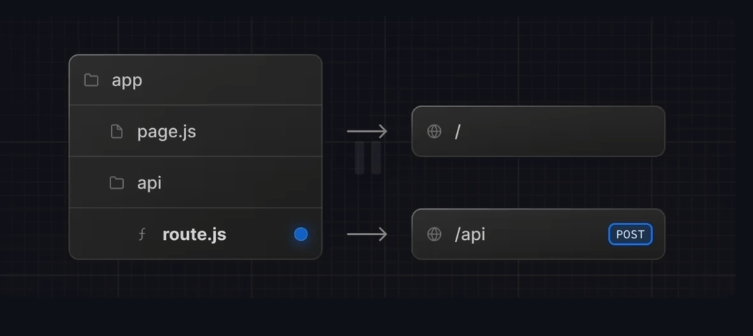
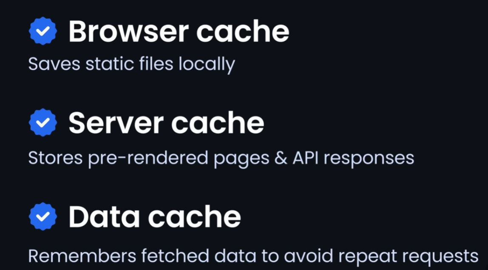
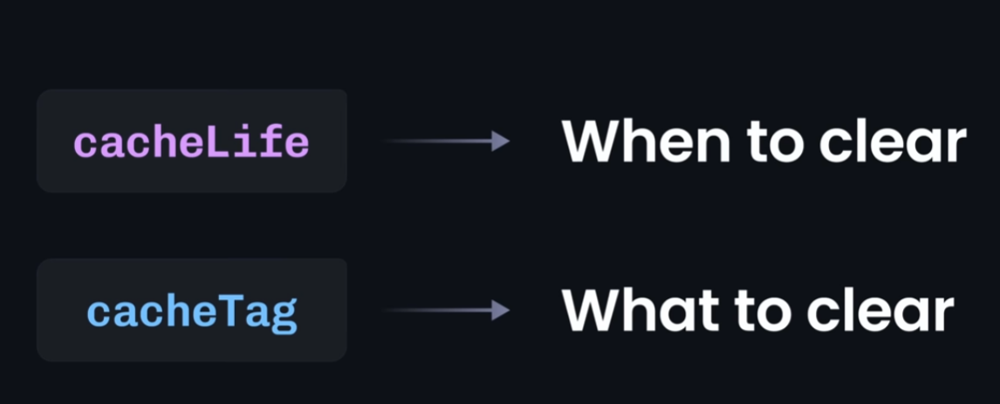
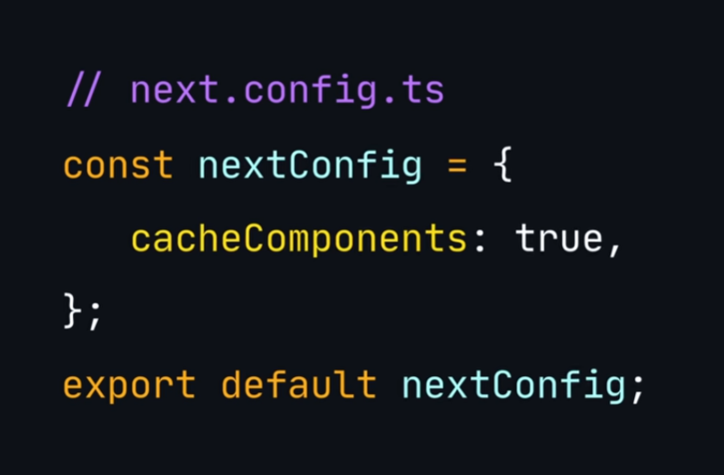

# NEST.js :
    Next.js is a complete framework built on top of React,
    adding server-side rendering, routing, and more,
    while React itself is just a UI library.

# setup :
1. npx create-next-app@latest ./

2. enable Tourbopackfilesystemcaching too . 
3. Also install and add reactCompiler:true in  nextconfig.ts 
    (npm install babel-plugin-react-compiler@latest)

# Tips :
    1. no need to import react from "react". (auto done by next)🤝
    2. no more memoization req : next does it itself during build 😎.
        To use Just install : npm install babel-plugin-react-compiler@latest
        nextConfig.ts mein do reactCompiler:true

# latest next 16 features
    1.Tourbo pack file system caching :
        Next.js development builds reload faster by caching
        compiled files on disk instead of rebuilding everything.
    to enable add :

    2. Nextjs also has Forbidden and unauthorized folder : show ui instead error 
    3. **Build Adapters**: next is work as vercel.  
### Simple meaning:
A **build adapter** tells Next.js **where and how your app will run after build**.

👉 Next.js builds your app once, but different platforms run apps differently.

So adapter = **translator between Next.js build and hosting platform**.

<!--  -->
---
# Lesson 1  : Sever Component (SSR and CSR)
***Advantage*** :
    1. Component render on server and pre rendered html output  sent to client.
    2. Direct access serversite Resources ( Database,Filesystem,security)
    3. Better SEO because content comes ready from server.
    4. Smaller JS bundle will sent to client → better performance.
***Limitation*** :
    1. cannot use (states,useEffects), browser event (onclick...).
    2. No direct access to browser APIs (window, localStorage).
***
# Lesson 2 : Client Side Rendering (CSR / Client Component)

***To Use*** :
    1. Write `"use client"` at the top of the component.

***Advantage*** :
    1. Supports state, effects and browser events (onClick, onChange).
    2. Enables interactive and dynamic UI in browser.

***Limitation*** :
    1. Larger JS bundle sent to client → slower initial load.
    2. Data fetching happens after page load → weaker SEO compared to SSR.

---
# Lesson 3 : Routes 
    1. every folder in app is a route 
    2. And every route has a page.tsx file which is the entry point of that route

    3. Nested Routes : yes u can make multiple folder/routes in one folder.
---
# Lesson 4 : Dynamic Route : 

    1. Based on user input or any specific date routes change aka link address

***How to do***
    1. warp the changing part in [ ]

---
# Lesson 5 : Layout.tsx 
    1. it is global layout : what ever u add here will reflect to all pages.

    2. We can create a Layout.tsx for any specific folder/route 
      so that ui be can share accrose all its children

    4. You can create a folder that dont show in URL : But Why? 
    

***Answer:***
    Now u can create very seperate layout.tsx for any route/folder so thatroot layout dont affect them.

    5. Obviously u cant : create 2 page.tsx , in one folder 
        Dont get confused with : (folders) they wont be contribute in url 

    6. Creating 2 page.tsx give error     

---
# Lesson 6 : Error Handaling (error.js)
    1. Nextjs has -> Error.js file that catches error and display them in UI.
    2. Nearest Error.js trigger to the error page.

---
# Lesson 7 : Data Fetching 
Ref:https://youtu.be/I1V9YWqRIeI?t=2590
**There are so many ways:**
1. Traditional way 

2. ServerSite Fetching : Faster , efficient ,clean code,Improve intial load time.
### Client Side Fetching
- Page first loads in browser.
- User may see loading state initially.
- API call happens in the client after render.
- Content appears after data is fetched.
- Data comes **after FCP (First Contentful Paint)**.

### Server Side Fetching
- API call happens on the server before sending HTML.
- Data is already fetched during rendering.
- Client receives ready-to-render UI.
- Content is visible at or near FCP.
- **Better SEO** : preload page has more content to crawl.
- **Request Deduplication** : avoid multiple fetch , api call. even u write multiple line first time happen and next from cached it reuse promise.
- **Security** : api keys remains in server no need to expose in client site .
- **Parallel Fetching**: multiple data requests run simultaneously on the server, avoiding network waterfall and reducing total loading time.

## ✅ Why UI did not update (HMR + Server Fetch Cache)

**Flow:**

1. Page loads → data is fetched from the API.
2. Next.js stores this result in the **Server Component HMR cache** (development only).
3. You change the code.
4. HMR (Hot Module Replacement) updates the code without full page reload ✅
5. Fetch is **not executed again** because cached data is reused ❌
6. UI looks unchanged since the same cached data is rendered.

> HMR is working correctly — the data remains the same due to caching, not because refresh failed.

---
# Lesson 8:  How we'll start Backend in Nextjs

    1. There is no need to setup , manage , active server manually . 
    2. setup is as same as frontend we did. 
    3. Just folder structre does that all . 

---
# Lesson 9 : Caching 
**Storing data Temporary , to reuse data and avoid Rebuilt/Refetched.**

    1. caching get reworked in Next 16.
    2. We have multipel layers of cache.

    3. Next js Brings : 'Use Cache' Directive 
    4. Use to Cache pages,components and functions. 15min is default to tune/configure cacheing (cacheLife("hours") = how long data's state  cached)
    
    5. How to Enable it. yes it is not enabled by default.
    

    6. To clear the cache on cmd. 

## PPR: Partial Pre-Rendering
- Only some parts of the page are pre-rendered at build time, others load on demand.
- Makes first load fast, but still gets fresh data when needed.
- Good for pages with both static and dynamic content.
- Next.js decides what to pre-render and what to fetch later, so you get best of both: speed + up-to-date info.

**Note:** If cache component is enabled, you don't need to set up PPR—Next.js handles it for you automatically.
---
# Lesson 10: Search Engine Optimization (SEO)

Next.js is great for SEO. You can add meta tags and other SEO info in two main ways:

## 1. Config-based Metadata (Recommended)
- Add a `metadata` object in your `layout.js` or `page.js`.
- Next.js auto-generates the right meta tags in your HTML.
- You can set unique meta for each route, or use a default for all pages.
- Dynamic meta (changes per page/user) is also possible.

## 2. File-based Metadata
- Just add files like `robots.txt`, `favicon.ico`, or `sitemap.xml` in the app folder.
- Next.js will use these files automatically.
- File-based meta can **override config-based** meta if both exist.
---

